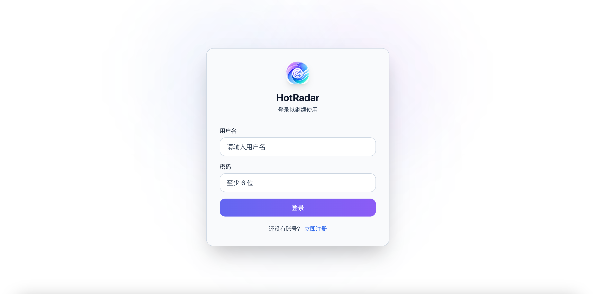
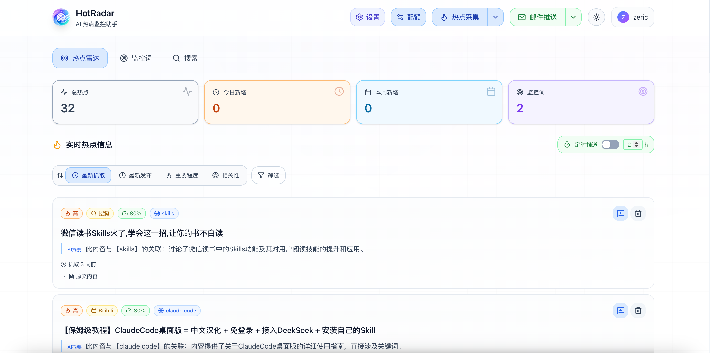
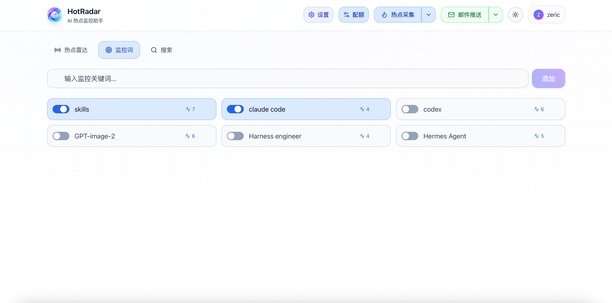
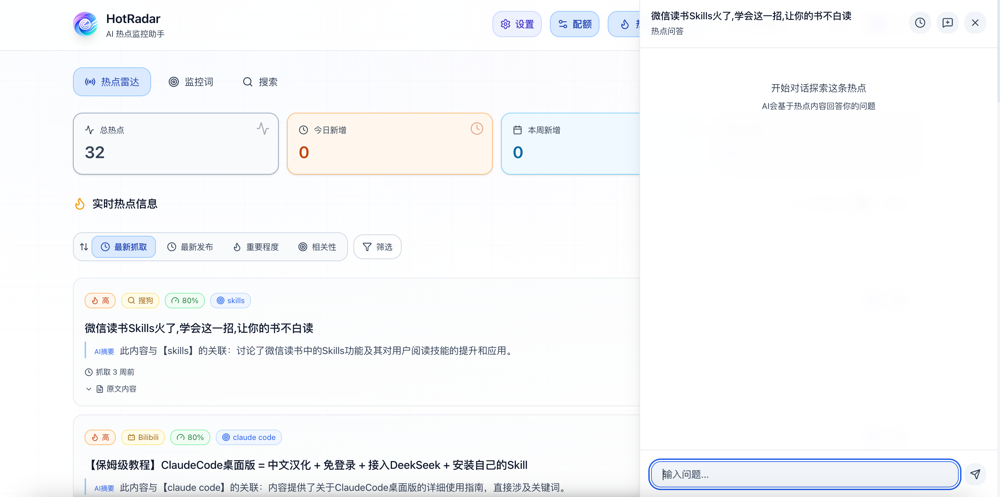
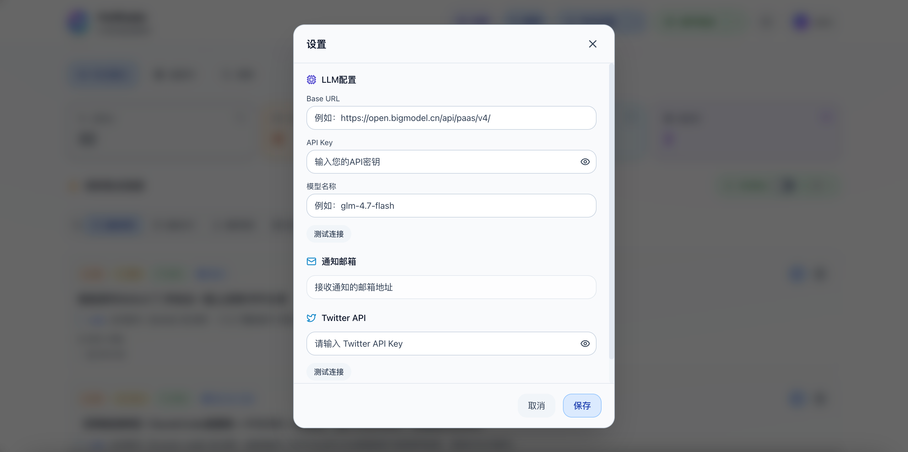

# HotRadar

AI 热点监控助手：一款基于大语言模型的智能热点信息采集、分析与监控系统。

## 项目简介

HotRadar 是一个自动化热点监控的助手，旨在帮助用户自动监控和追踪互联网上的热点信息。系统通过配置关键词，自动从多个数据源（Twitter、YouTube、Bilibili、抖音、Bing、搜狗等）采集相关信息，利用 AI 进行智能分析、过滤和摘要，并通过邮件通知用户。

### 核心功能

- **多数据源采集**：支持 Twitter、YouTube、Bilibili、抖音、Bing、搜狗等平台
- **AI 智能分析**：使用 LLM 对热点内容进行相关性评估、真实性判断和摘要生成
- **关键词管理**：支持多用户、多关键词监控配置
- **定时任务**：内置调度器，支持灵活的定时采集策略
- **邮件通知**：支持 SMTP 邮件推送热点信息
- **Web 界面**：现代化的前端界面，支持热点浏览、筛选和详情查看
- **热点对话**：基于热点内容与 AI 进行交互问答
- **配额管理**：可配置各数据源的采集数量配额

---

## 界面展示

### 登录页面

简洁的用户认证界面，支持用户注册与登录。



### 主页概览

热点列表页面，展示抓取到的所有热点信息，支持按时间、来源、重要程度、关键词、相关性等维度进行筛选和排序。



### 监控词管理

用户可以在监控词管理页面进行添加、编辑和删除监控关键词，支持批量导入。



### 热点对话

基于热点内容与 AI 进行智能问答，深入探讨热点话题细节。



### 系统设置

配置 LLM API、邮件通知、Twitter API 等系统所需的信息。



---

## 技术栈

### 后端
- **FastAPI** - 高性能异步 Web 框架
- **SQLAlchemy** - ORM 框架
- **MySQL** - 主数据库
- **Redis** - 缓存服务
- **LangGraph** - 工作流编排
- **LangChain** - LLM 应用框架

### 前端
- **React 19** - UI 框架
- **TypeScript** - 类型安全
- **Vite** - 构建工具
- **Tailwind CSS** - 样式框架
- **Framer Motion** - 动画库

## 项目结构

```
hotradar/
├── backend/                    # 后端服务
│   ├── api/                    # API 路由
│   │   └── v1/                 # v1 版本接口
│   ├── common/                 # 公共组件
│   ├── core/                   # 核心配置
│   ├── models/                 # 数据模型
│   ├── services/               # 业务服务
│   ├── tests/                  # 测试文件
│   ├── main.py                 # 入口文件
│   └── requirements.txt        # Python 依赖
├── frontend/                   # 前端应用
│   ├── src/                    # 源代码
│   ├── dist/                   # 构建产物
│   └── package.json            # Node 依赖
├── agents/                     # AI 工作流
│   └── hotspot_collect_agent/  # 热点采集工作流
├── llm/                        # LLM 调用服务
├── scripts/                    # 运维脚本
│   ├── init_db.py              # 数据库初始化
│   └── migrations/             # 数据库迁移
├── assets/                     # 静态资源
└── docker-compose.yml          # Docker 编排配置
```

---

## 部署指南

### 前置要求

- Python 3.10+
- Node.js 18+
- MySQL 8.0+
- Redis 6.0+
- Conda（推荐）

---

### 方式一：本地部署

#### 1. 克隆项目

```bash
git clone https://github.com/zhangzg1/hotradar.git
cd hotradar
```

#### 2. 配置环境变量

复制环境变量模板并填写配置：

```bash
cp .env.example .env
```

编辑 `.env` 文件，配置以下内容：

| 变量名 | 说明 | 示例 |
|--------|------|------|
| `MYSQL_HOST` | MySQL 主机地址 | `localhost` |
| `MYSQL_PORT` | MySQL 端口 | `3306` |
| `MYSQL_USER` | MySQL 用户名 | `root` |
| `MYSQL_PASSWORD` | MySQL 密码 | `your_password` |
| `MYSQL_DATABASE` | 数据库名称 | `hotradar` |
| `REDIS_HOST` | Redis 主机地址 | `localhost` |
| `REDIS_PORT` | Redis 端口 | `6379` |
| `REDIS_PASSWORD` | Redis 密码 | `` |
| `JWT_SECRET_KEY` | JWT 密钥 | 随机字符串 |
| `SETTINGS_ENCRYPTION_KEY` | 设置加密密钥 | 随机字符串 |
| `QWEN_API_KEY` | 通义千问 ASR API Key | 用于音频转文字 |
| `YOUTUBE_API_KEY` | YouTube Data API Key | 用于 YouTube 数据获取 |
| `SMTP_HOST` | SMTP 服务器地址 | `smtp.qq.com` |
| `SMTP_PORT` | SMTP 端口 | `465` |
| `SMTP_USER` | SMTP 用户名 | `your_email@qq.com` |
| `SMTP_PASSWORD` | SMTP 授权码 | `your_auth_code` |

#### 3. 创建 Conda 虚拟环境

```bash
conda create -n hotradar python=3.10
conda activate hotradar
```

#### 4. 安装后端依赖

```bash
cd backend
pip install -r requirements.txt
```

#### 5. 初始化数据库

确保 MySQL 服务已启动，然后执行：

```bash
cd ..
python scripts/init_db.py
```

#### 6. 启动后端服务

```bash
cd backend
python main.py
```

后端服务将在 `http://localhost:8000` 启动。

API 文档地址：`http://localhost:8000/docs`

#### 7. 安装前端依赖

打开新终端窗口：

```bash
cd frontend
npm install
```

#### 8. 启动前端开发服务器

```bash
npm run dev
```

前端开发服务器将在 `http://localhost:5173` 启动。

#### 9. 构建前端生产版本

```bash
npm run build
```

构建产物将输出到 `frontend/dist/` 目录。

---

### 方式二：Docker 部署

#### 1. 克隆项目

```bash
git clone https://github.com/zhangzg1/hotradar.git
cd hotradar
```

#### 2. 配置环境变量

```bash
cp .env.example .env
```

编辑 `.env` 文件，填写必要的配置信息（同本地部署）。

**注意**：Docker 部署时，MySQL 和 Redis 的主机地址应使用服务名称：
- `MYSQL_HOST=mysql`
- `REDIS_HOST=redis`

#### 3. 构建并启动服务

```bash
docker-compose up -d --build
```

#### 4. 查看服务状态

```bash
docker-compose ps
```

#### 5. 查看日志

```bash
# 查看所有服务日志
docker-compose logs -f

# 查看应用服务日志
docker-compose logs -f app
```

#### 6. 停止服务

```bash
docker-compose down
```

#### 7. 停止并删除数据卷

```bash
docker-compose down -v
```

#### Docker 服务说明

| 服务名 | 端口 | 说明 |
|--------|------|------|
| `mysql` | 3306 | MySQL 数据库 |
| `redis` | 6379 | Redis 缓存 |
| `app` | 80 | 前后端一体化应用（Nginx + FastAPI） |

#### Docker 部署架构

```
┌─────────────────────────────────────────────────────────────┐
│                      Docker Network                          │
├─────────────────────────────────────────────────────────────┤
│                                                              │
│   ┌─────────────────────────────────────┐   ┌───────────┐  │
│   │            app 容器                  │   │   redis   │  │
│   │  ┌─────────┐     ┌─────────────┐   │   │   :6379   │  │
│   │  │  Nginx  │────▶│   FastAPI   │   │   └───────────┘  │
│   │  │  :80    │     │   :8000     │   │         ▲        │
│   │  └─────────┘     └─────────────┘   │         │        │
│   │       ▲                │            │         │        │
│   └───────│────────────────│────────────┘         │        │
│           │                │                      │        │
│           │                ▼                      │        │
│           │         ┌───────────┐                 │        │
│           │         │   mysql   │─────────────────┘        │
│           │         │   :3306   │                          │
│           │         └───────────┘                          │
│           │                ▲                               │
│           │                │                               │
│     外部访问 :80            └───────────────────────────────┘
│                                                              │
└─────────────────────────────────────────────────────────────┘
```

#### 单镜像说明

本项目采用 **All-in-One** 镜像设计，前后端打包在同一个 Docker 镜像中：
- 使用多阶段构建，先构建前端，再打包到最终镜像
- 容器内使用 **Supervisor** 管理 Nginx 和 FastAPI 进程
- Nginx 监听 80 端口，提供静态文件并代理 API 请求到内部 8000 端口
- 只需暴露一个端口 (80)，简化部署和配置

---

## 配置说明

### LLM 配置

系统启动后，登录管理界面，在「设置」页面配置 LLM：
- **Base URL**：LLM API 地址（如 OpenAI 兼容的 API）
- **API Key**：API 密钥
- **模型名称**：使用的模型名称

### 数据源配置

系统支持以下数据源：

| 数据源 | 需要配置 | 说明 |
|--------|----------|------|
| Twitter | Twitter API Key | 需付费 API |
| YouTube | YouTube API Key | 在 `.env` 中配置 |
| Bilibili | 无 | 网页爬虫 |
| 抖音 | Cookie | 在界面中配置 |
| Bing | 无 | 网页爬虫 |
| 搜狗 | 无 | 网页爬虫 |

### 配额配置

在「配额管理」页面可配置各数据源的采集数量限制。

### 邮件通知配置

在「邮件通知」页面配置 SMTP 信息后，可开启热点邮件推送功能。

---

## API 文档

启动后端服务后，访问以下地址查看 API 文档：

- Swagger UI: `http://localhost:8000/docs`
- ReDoc: `http://localhost:8000/redoc`

### 主要 API 端点

| 端点 | 方法 | 说明 |
|------|------|------|
| `/api/v1/auth/register` | POST | 用户注册 |
| `/api/v1/auth/login` | POST | 用户登录 |
| `/api/v1/keywords` | GET/POST | 关键词管理 |
| `/api/v1/hotspots` | GET | 热点列表 |
| `/api/v1/collections/run` | POST | 触发采集任务 |
| `/api/v1/settings` | GET/PUT | 系统设置 |
| `/api/v1/scheduler` | GET/PUT | 调度器配置 |

---

## 开发指南

### 后端开发

```bash
conda activate hotradar
cd backend
python main.py
```

### 前端开发

```bash
cd frontend
npm run dev
```

### 运行测试

```bash
# 后端测试
cd backend
pytest tests/

# 前端测试
cd frontend
npm run test
```

---

## 常见问题

### 1. 数据库连接失败

- 检查 MySQL 服务是否启动
- 确认 `.env` 中的数据库配置正确
- 确认数据库已创建

### 2. Redis 连接失败

- 检查 Redis 服务是否启动
- 确认 `.env` 中的 Redis 配置正确

### 3. 前端无法连接后端

- 确认后端服务已启动
- 检查 CORS 配置

### 4. Twitter 数据采集失败

- 确认已配置有效的 Twitter API Key
- Twitter API 需要付费订阅
